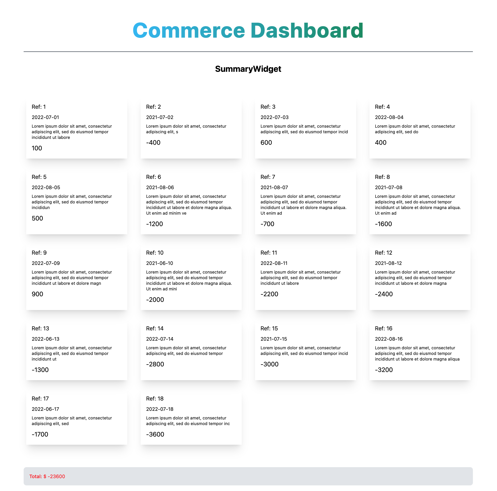
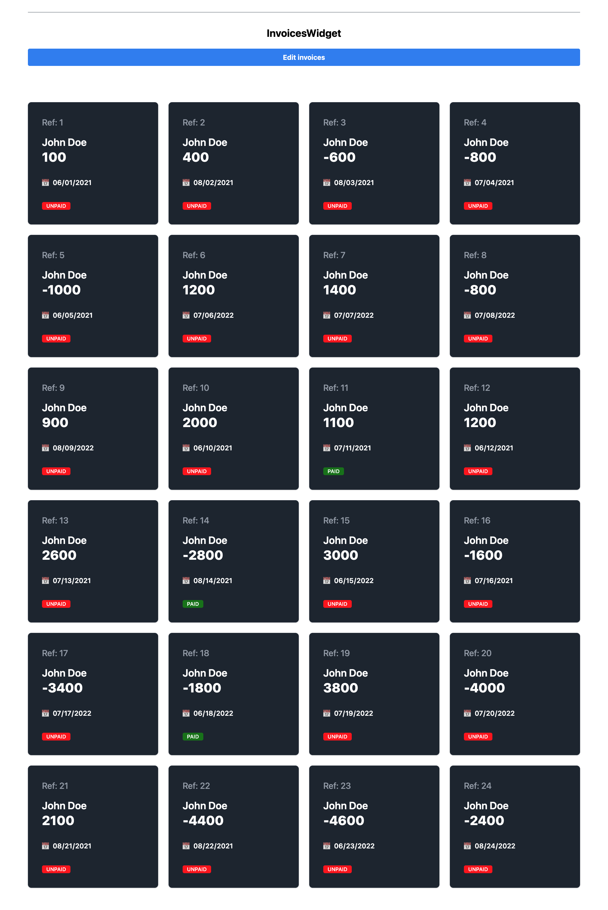
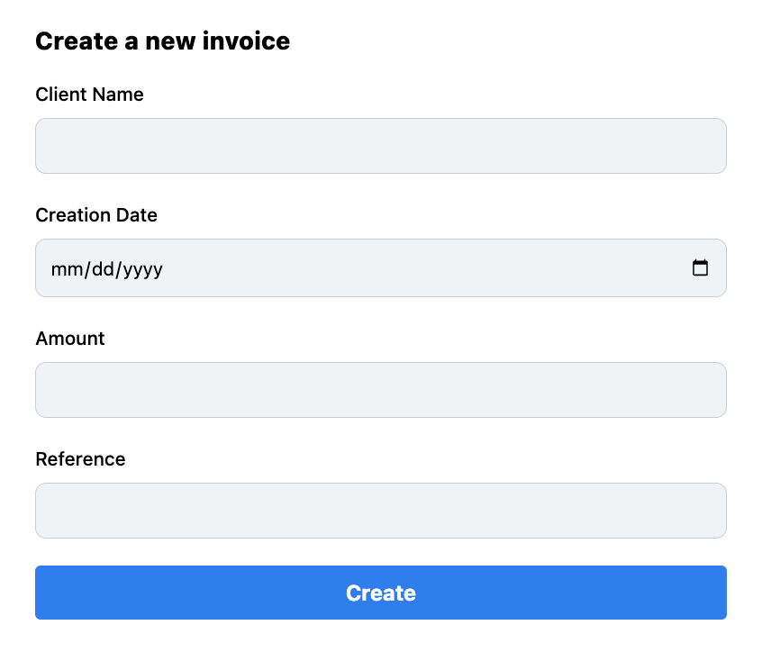

# Craft Project - Commerce Dashboard

A responsive web application that helps self-employed individuals to track their income and expenses in order to give them better insights of their monetary situation

## Preview





### TODOs

- Change type to 'PAID' | 'UNPAID'
- Use form component with API call
- Remove setters after implementing API
- Show the number of invoices created in the last 30 day
- Implement functionality to change threshold
- Check for repeated reference number
- Update existing invoice
- Generate UUID

## Usage

### Development

Run the dev server:

```sh
npm run dev
```

### Deployment

First, build your app for production:

```sh
npm run build
```

Then run the app in production mode:

```sh
npm start
```

Now you'll need to pick a host to deploy it to.

#### DIY

If you're familiar with deploying Node applications, the built-in Remix app server is production-ready.

Make sure to deploy the output of `npm run build`

- `build/server`
- `build/client`

### Styling

This template comes with [Tailwind CSS](https://tailwindcss.com/) already configured for a simple default starting experience. You can use whatever css framework you prefer. See the [Vite docs on css](https://vitejs.dev/guide/features.html#css) for more information.

